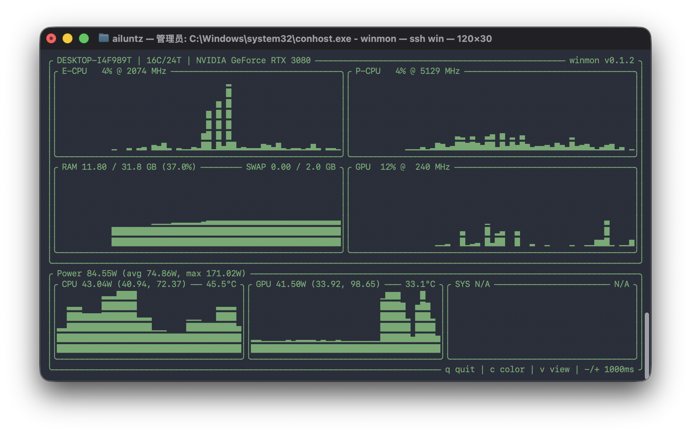

# `winmon` - Windows Monitor

<div align="center">

Terminal hardware monitor for Windows.

[Windows](https://github.com/ailuntz/winmon) · [macOS](https://github.com/ailuntz/macmon) · [Linux](https://github.com/ailuntz/linmon)

</div>

<div align="center">
  
</div>

Chinese docs are under [docx](/Volumes/usb_main/usb_main/test_bug/winmon/docx).

## Scope

- Windows 10/11 x64

## Usage

```powershell
winmon
winmon pipe -s 1 --device-info
winmon debug
winmon serve
```

Controls:

- `q` quit
- `c` color
- `v` view

## Install

Download the latest release zip, extract it, and run `winmon.exe` once.

After installation, you can run:

```powershell
winmon
```

PowerShell install also works:

```powershell
$p = Join-Path $env:TEMP "winmon-install.ps1"
iwr "https://github.com/ailuntz/winmon/releases/latest/download/install.ps1" -UseBasicParsing -OutFile $p
powershell -NoProfile -ExecutionPolicy Bypass -File $p
```

If you are inside `cmd`, or connected from macOS through `ssh win`, use:

```cmd
curl.exe -L --fail --silent --show-error "https://github.com/ailuntz/winmon/releases/latest/download/install.ps1" -o "%TEMP%\winmon-install.ps1"
powershell -NoProfile -ExecutionPolicy Bypass -File "%TEMP%\winmon-install.ps1"
```

## HTTP Server

```powershell
winmon serve
winmon serve --port 9090
```

Endpoints:

- `GET /json`
- `GET /metrics`

For Prometheus and Grafana, see [example-grafana](/Volumes/usb_main/usb_main/test_bug/winmon/example-grafana).

In the current LAN setup:

```bash
cd example-grafana
docker compose up -d
```

- Prometheus: `http://localhost:9091`
- Grafana: `http://localhost:9000`
- Grafana user: `winmon`
- Grafana password: `winmon`

## Notes

- Settings are stored in `%APPDATA%\winmon\config.json`
- On some systems, `CPU temp` and `E-CPU` / `P-CPU` sensors require administrator privileges. Without admin they fall back to `N/A`.
- `sys_power` currently stays `N/A`

## Thanks

- [macmon](https://github.com/vladkens/macmon) for the original layout and interaction direction
- [OpenHardwareMonitorLib](https://www.nuget.org/packages/OpenHardwareMonitorLib) for Windows hardware sensor access

## License

Repository code is released under `MIT`.
